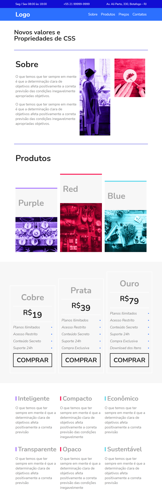

### Site com Flexbox

Link do site: https://evertonvargas.github.io/FlexBox-CSS/

>Produzido no curso da [Origamid](https://www.origamid.com/) de flexbox 

O curso e a construção do site me permitiram aprender como aplicar flexbox nos sites. Como é algo dinâmico e que facilita muito o desenvolvimento.

Aguarde o carregamento da foto para visualizar o resultado...

  

